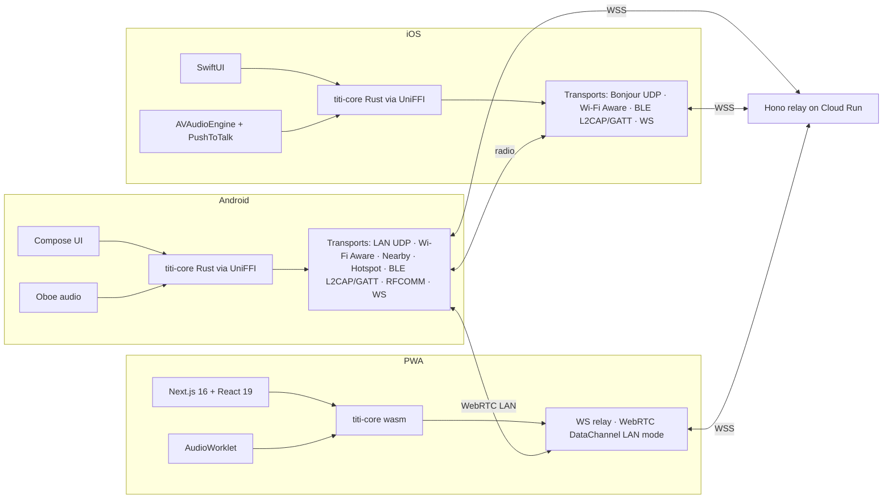

# Titi — Architecture

Offline-first walkie-talkie for Android, iOS and web. Works with **no cellular
and no internet** over whatever radio two phones share, upgrades to internet
when available, and hands over between links without dropping the
conversation.

Decisions here were made with the user on 2026-09-14 after the research in
`docs/research/`. Each numbered ADR in `docs/adr/` records one decision and
its alternatives. `docs/TRACKER.md` is the single canonical implementation
tracker.

## 1. Product principles

1. **Talk first.** Open the app → one giant amber Talk button. Everything else
   is secondary.
2. **Zero-config nearby.** Two phones running Titi on the same Wi‑Fi/hotspot
   or within BLE range see each other and can form a group in two taps
   (invite → accept). No accounts.
3. **Always a path.** LAN → Wi‑Fi Aware → Nearby Connections → hotspot → BLE
   L2CAP → BLE GATT → internet relay. The app picks the best link and moves
   the session transparently.
4. **Private by default.** Everything end-to-end encrypted with a group key;
   relays (mesh peers or the internet relay) cannot listen.
5. **Beautiful and calm.** Dark-first graphite + amber, morphing PTT button,
   shared-element transitions, haptics on every floor event.

## 2. System overview



### 2.1 Layers (identical on all clients)

| Layer | Owner | Notes |
|---|---|---|
| UI | native (Compose / SwiftUI / React) | per-platform design system, shared tokens in `docs/design/` |
| Audio I/O | native | Oboe / AVAudioEngine / AudioWorklet; 48 kHz mono, 20 ms ticks |
| **Core** (`core/titi-core`, Rust) | shared | frame codec, Noise + group crypto, mesh routing/dedup/TTL, floor control, jitter buffer, Opus (libopus via `audiopus`/`opus` crate), invite codes |
| Transports | native | implement a small `Link` interface; hand bytes to core, receive `Action`s |
| Relay | `apps/backend` Hono 4 | forward-only, E2E-blind WebSocket relay + signalling |

The core is a **pure state machine**: `on_frame(link_id, bytes) -> Vec<Action>`,
`on_tick(now) -> Vec<Action>`, `on_ptt_down/up()`, `on_audio_in(pcm)`. Actions
are `Send{link, peer, bytes}`, `Play{pcm}`, `Ui{event}`. This keeps every
platform-specific piece trivially thin and makes the protocol testable in
Rust alone.

## 3. Transports and layering order

Preference order (lower cost wins; measured, not assumed):

| # | Link | A↔A | A↔iOS | iOS↔iOS | Web | Bandwidth | Setup |
|---|---|---|---|---|---|---|---|
| 1 | Same Wi‑Fi / hotspot: mDNS `_titi._udp` + UDP unicast | ✓ | ✓ | ✓ | ✓ (WebRTC to phone) | Mbps | none |
| 2 | Wi‑Fi Aware (NAN) | ✓ (HW-gated) | ✓ iOS 26+/iPhone 12+ (unverified interop) | ✓ | – | Mbps | pairing picker on iOS |
| 3 | Nearby Connections P2P_CLUSTER (GMS) | ✓ | – | – | – | 5 KB/s → Mbps upgrade | auto |
| 4 | Android LocalOnlyHotspot + QR creds → iOS `NEHotspotConfiguration` | host | ✓ | – | ✓ | Mbps | one prompt |
| 5 | BLE L2CAP CoC (PSM via GATT) | ✓ API 29+ | ✓ | ✓ | – | 200–700 kbps | none |
| 6 | BLE GATT (write-w/o-response + notify) | ✓ | ✓ | ✓ | – | 20–60 KB/s | none |
| 7 | BT Classic RFCOMM (insecure socket) | ✓ | – | – | – | 100–300 kbps | none |
| 8 | Internet: WSS to relay | ✓ | ✓ | ✓ | ✓ | Mbps | internet |

**Control plane** (HELLO/ANNOUNCE/FLOOR/JOIN/TEXT) always runs over BLE when
available — it is the universal floor and costs little. **Voice plane** picks
the cheapest link with `min_bps ≥ profile bitrate`.

MultipeerConnectivity is **not used** (deprecated in Xcode 27, background
death, Apple-only). Nearby Messages / ultrasonic is **not used** (deprecated).

## 4. Voice pipeline

- **Codec**: libopus 1.6 everywhere. Profiles: HQ 24 kbps/20 ms (LAN), STD 16–20
  kbps (internet), LOW 12 kbps/40 ms (L2CAP), MIN 6–8 kbps NB/60 ms (GATT).
  Talker picks the profile from the weakest hop on its route; relays never
  transcode. FEC (LBRR) on for LOW/MIN, DTX on in full-duplex.
- **Frame**: 7-byte header `type | flags | talker16 | seq16 | ts16(20 ms)`
  inside group AEAD inside per-link Noise session. No RTP.
- **Jitter buffer**: per talker, adaptive P95 of inter-arrival, clamp
  [1 frame, 300 ms], reset on talker change. Opus PLC + FEC; fade after 3
  losses.
- **Modes**: PTT (half-duplex, MCPTT-lite distributed floor control:
  FLOOR_REQ/TAKEN/IDLE, `(prio, ts, id)` arbitration, T_arb 80–250 ms, 60 s max,
  emergency pre-empt) and **Full-duplex** (≤3 simultaneous talkers,
  leader-mixing when a leader/relay exists, else client mixing). Switchable
  per group at runtime; the button morphs (circle → bar/mute pill).
- **Latency budget**: ~75 ms LAN, 150–210 ms BLE L2CAP, 130–250 ms internet.

## 5. Mesh protocol v1 (details: research 03 §8)

- Identity: Ed25519 (+X25519 derived). `node_id` = 8 B BLAKE2b(pubkey).
- Envelope per hop: `ver | type | ttl:4/hop_start:4 | flags | msg_id32 | src8 | [dst8]`.
  Dedup LRU 2048 / 5 min. TTL 7 (5 when ≥6 links).
- HELLO link-local every 4 s alone → 15–30 s jittered; ANNOUNCE (signed, ≤10
  neighbours) flood every 30–60 s → 2-hop map on every node.
- Control: controlled flood (bitchat constants: jitter 10–220 ms, split
  horizon, cancel on duplicate).
- Voice: source-routed over confirmed paths (≤3 relays), cost = link base +
  1000/bps + rtt; immediate forwarding; flood TTL 3 fallback.
- Handover: `STABLE → DEGRADED (bicast ≤1 s) → SWITCHING (profile renegotiate) → STABLE`,
  `SUSPENDED` after 3 s without route. Session/seq/ts survive the switch.

## 6. Security

- Per-link: `Noise_XX_25519_ChaChaPoly_SHA256` (IK when responder key known).
- Group: `K_epoch = HKDF(Argon2id(code, salt=group_uuid), info="titi/v1/group"‖epoch)`;
  payload `XChaCha20-Poly1305`, nonce = `talker8 ‖ epoch4 ‖ seq32 ‖ 0…`; per-talker
  replay window; `KEY_ROTATE` on leave (no group FS in v1 — documented).
- Libraries: Rust `snow`, `chacha20poly1305`, `x25519-dalek`, `ed25519-dalek`,
  `argon2`, `blake2`, compiled once for all platforms.

## 7. Invite / join

1. **Tap-to-invite** (primary, nearby): host sees discovered devices in a
   radar; taps one → `INVITE_OFFER` → other device shows accept sheet →
   `group_uuid` + `K_join` inside Noise XX.
2. **Code** (secondary): `3 words + 2 digits`, e.g. `tiger-river-42` (EFF short
   wordlist, ~40 bits incl. check digits), rotating per **10‑min slot** from
   `K_invite`; joiner proves via `Noise_XXpsk3`; joiner tries slots −1..+1.
   Only works when the joiner can also hear the group HELLO (nearby) or via
   the relay — the code is never the sole secret.
3. **QR / deep link** `titi://j/<uuid>/<key>/<exp>/<sig>` (internet or web).

## 8. Internet relay (`apps/backend`)

Hono 4 + `@hono/node-server` WebSocket on Cloud Run gen2, `europe-west1`,
`--timeout 3600 --session-affinity`, min-instances 0 (bump to 1 if cold
start hurts). Binary WS frames = same protobuf control messages + Titi
encrypted voice frames. Rooms in memory; Upstash Redis pub/sub only when
>1 instance. No DB in v1. TURN/SFU deferred (Cloudflare Realtime when needed).

## 9. Web PWA (`apps/web`)

Next.js 16 + React 19 + Tailwind v4 + shadcn + Motion, Serwist SW, Zustand,
AudioWorklet capture/playback, WebCodecs Opus with libopus-wasm fallback,
`titi-core` wasm for framing/crypto. **Online mode** = WS relay. **LAN mode**
(installed PWA only, secure-context wall): WebRTC DataChannel to the native
phone, host ICE candidates, signalling via QR (all browsers) or LNA long-poll
(Chrome 142+). iOS web is foreground-only.

## 10. Wire schema

`proto/titi/v1/*.proto` via **buf** → Wire (Kotlin), swift-protobuf, protobuf-es,
prost. Audio frame header is hand-packed (spec in ADR‑0003), implemented once
in Rust. `testvectors/*.json` generated by Rust and consumed by every suite.

## 11. Repo layout

```
titi/
├─ proto/                 buf schema (source of truth)
├─ core/                  Rust: titi-core, titi-ffi (UniFFI), titi-wasm
├─ packages/protocol      TS generated protobuf + helpers
├─ packages/core-wasm     built wasm package
├─ apps/web               Next.js 16 PWA
├─ apps/backend           Hono relay (Dockerfile)
├─ android/               Gradle: app + core-ffi
├─ ios/                   XcodeGen project.yml, Titi/, TitiCore/
├─ testvectors/
├─ docs/  adr/ research/ design/ TRACKER.md ARCHITECTURE.md
└─ .github/workflows/
```

## 12. Toolchain (Sept 2026)

AGP 9.4 / Gradle 9.6 / Kotlin 2.4 / JDK 21 / Compose BOM 2026.08 / material3
1.5 Expressive / compile+target 36 / min 26 · Rust stable + cargo-ndk +
uniffi 0.31 + wasm-bindgen · Swift 6.3 (Windows toolchain for `swift test`),
Xcode 26 on `macos-26` · Node 24 / pnpm 10 / Hono 4 · buf 1.x.

## 13. Delivery order

1. Core (Rust) + test vectors + backend relay.
2. Android: LAN transport + audio + PTT → two-phone test (A51 ↔ S25).
3. Android: BLE L2CAP/GATT, Nearby, hotspot, handover, mesh relay.
4. Web PWA online mode, then LAN mode.
5. Android: text/voice notes S&F, hardware PTT, widgets, offline map + location,
   SOS, sound packs/themes, EN/RO.
6. iOS skeleton (compiles logic on Windows via `swift test`; UI validated in
   CI after Apple enrolment).
7. Reality check vs tracker → Play internal testing → closed testing (12
   testers × 14 days) → production.
