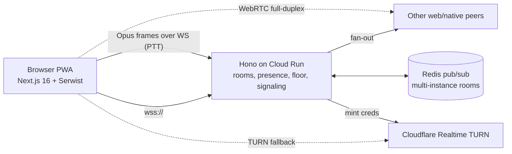

# 04 — Web / PWA client for Titi

Research date: 2026-09-14. Scope: a browser client for people who will not
install the native Android/iOS app. Two target modes: **online** (via the Hono
backend on Cloud Run) and **LAN-offline** (same hotspot/LAN as a phone running
the native app, no internet). Every claim below is tagged with a URL; where a
figure was only found in secondary sources this is stated.

---

## 0. Executive verdict

| Mode | Verdict | One-line reason |
|---|---|---|
| Online PTT (WebSocket relay of Opus frames via Hono/Cloud Run) | **Feasible, recommended V1** | Only needs `getUserMedia` + WebSocket + WebCodecs/wasm Opus; Cloud Run supports WS up to 60 min. |
| Online full-duplex 1:1 (WebRTC P2P + TURN) | **Feasible** | Standard WebRTC; TURN must live outside Cloud Run (no UDP). |
| Online full-duplex groups (>3) | **Feasible with an SFU**, costs money or ops | Cloudflare Realtime SFU / LiveKit; mesh does not scale past ~4. |
| LAN-offline, browser ↔ native phone, **zero internet ever** | **Not feasible** for a first-time visitor | No secure context ⇒ no `getUserMedia`, no Service Worker, no Web Bluetooth. |
| LAN-offline, browser that **installed the PWA while online** | **Feasible on Chrome Android/desktop, fragile on Safari** | Cached HTTPS PWA + WebRTC host candidates + local signaling through the phone (Chrome 142+ LNA prompt; mixed-content exemption for private-IP literals). |
| Web Bluetooth voice | **Not feasible** | GATT-only, no L2CAP CoC, ~100–200 kbps practical, no Safari/Firefox. |

---

## 1. Capability matrix (Sept 2026)

Sources: caniuse pages linked per row; WebKit Safari 26.0 release notes
<https://webkit.org/blog/17333/webkit-features-in-safari-26-0/>.

| Capability | Chrome Android | Chrome desktop | Safari iOS (26.x) | Firefox |
|---|---|---|---|---|
| `getUserMedia` (needs secure context) | ✅ | ✅ | ✅ (also in Home-Screen web app since iOS 13, per firt.dev) | ✅ |
| WebRTC PeerConnection + Opus | ✅ | ✅ | ✅ | ✅ |
| `RTCRtpScriptTransform` (Encoded Transform, E2EE) | ✅ 141+ | ✅ 141+ | ✅ 15.4+ | ✅ 117+ — <https://caniuse.com/mdn-api_rtcrtpscripttransform> |
| Legacy `createEncodedStreams` (Insertable Streams) | ✅ (Chrome-only) | ✅ | ❌ | ❌ |
| WebCodecs `AudioEncoder`/`AudioDecoder` (Opus) | ✅ 94+ | ✅ 94+ | ✅ **26.0+** (16.4–18.7 video-only) | ✅ 130+ — <https://caniuse.com/webcodecs> |
| `MediaStreamTrackProcessor` (audio) | ◐ Window-exposed only | ◐ | ✅ 18.0+ | ❌ — <https://caniuse.com/mdn-api_mediastreamtrackprocessor> |
| AudioWorklet | ✅ | ✅ | ✅ (14.5+) | ✅ |
| Web Bluetooth (GATT) | ✅ | ✅ (Win/Mac/ChromeOS; Linux behind flag) | ❌ | ❌ — <https://caniuse.com/web-bluetooth> |
| Web NFC (NDEF) | ✅ 89+ | ❌ | ❌ | ❌ — <https://caniuse.com/webnfc> |
| Web Push (installed PWA) | ✅ | ✅ | ✅ 16.4+, Home-Screen only, **not in EU** (DMA, iOS 17.4+) | ✅ |
| Background audio while PWA in background/locked | ✅ (Media Session) | ✅ | ❌ unreliable; iOS 26 PWA audio regressions reported | ✅ desktop |
| Service Worker offline shell | ✅ | ✅ | ✅ | ✅ |
| Local Network Access prompt | ✅ 142+ (fetch/subresource; WS/WebRTC gating "soon") | ✅ 142+ | n/a (no LNA; mixed content blocked) | 151+ prompt reported by Duo docs |
| `beforeinstallprompt` | ✅ | ✅ | ❌ | ❌ |

---

## 2. Can a browser reach a phone on the same LAN without internet?

### 2.1 Secure-context wall

`getUserMedia`, Service Workers, Web Bluetooth, Web NFC and Web Push all
require a **secure context** (`https://`, or `http://localhost`/`127.0.0.1`).
A page served by the phone at `http://192.168.43.1/` is **not** a secure
context → **no microphone**. This is the single hard blocker for the
"captive-portal PWA" idea. (MDN secure contexts:
<https://developer.mozilla.org/en-US/docs/Web/Security/Secure_Contexts>.)

Ways around, and why each fails or half-works:

| Idea | Status |
|---|---|
| Phone serves `https://` with self-signed cert | Browser shows interstitial; Chrome Android allows "proceed" but the origin is then treated as **insecure** for powerful features (mic denied). Safari iOS refuses to add trust without installing a profile. Not viable for strangers. |
| Phone serves `https://titi.local` with a real cert | Public CAs do not issue for `.local`/private IPs (CA/B Forum). ❌ |
| Phone serves `https://<public-name>` with a real Let's Encrypt cert whose DNS resolves (via hotspot DHCP/DNS) to the phone's LAN IP | **Works technically**: the cert is valid for the hostname, TLS doesn't care about the IP. Requires shipping the private key inside the app (a leaked key = revoked cert), 90-day renewal only while online, and the phone must be the DNS server (Android hotspot lets you not; iOS hotspot does not). Fragile; Chrome LNA will still prompt once WS/WebRTC gating ships. Keep as a research spike, not V1. |
| Install PWA while online, then use cached shell offline | ✅ **The realistic path.** Service worker precaches the app; opening the installed icon offline yields a secure-context page at the real `https://titi.app` origin. Mic works. |

### 2.2 Chrome Local Network Access (LNA) — 2025–2026 status

- Replaced Private Network Access (PNA, abandoned). Shipped in **Chrome 142**
  as a permission prompt ("Look for and connect to any device on your local
  network"). <https://developer.chrome.com/blog/local-network-access>,
  <https://chromestatus.com/feature/5152728072060928>
- Permission is **only requestable from a secure context**.
- **Mixed-content exemption**: once granted, `fetch("http://192.168.x.x/…")`,
  `http://*.local`, or `fetch(url,{targetAddressSpace:"local"})` from an HTTPS
  page is allowed (same blog post). This is the key enabler for an HTTPS PWA
  talking to a phone-hosted plain-HTTP server.
- **Not yet gated (and therefore not yet mixed-content-exempted)**: WebSocket
  (crbug 421156866), WebTransport (421216834), WebRTC (421223919). Chrome says
  it "plans to ship LNA for WebSockets, WebTransport, and WebRTC soon". Until
  then `ws://192.168.x.x` from an HTTPS page is **blocked as mixed content**.
  WebRTC data/media to LAN peers works without prompt today.
- Chrome 145/146 split the permission into "Local Network" and "Loopback
  Network" (Okta support note, Chrome community thread). Enterprise policy
  `LocalNetworkAccessAllowedForUrls` exists.
- Firefox 151 and Edge 143 ship a similar prompt (Cisco Duo guide).
- Safari: no LNA; plain-HTTP requests from HTTPS remain blocked as mixed
  content. Only WebRTC can reach the LAN peer.

**Consequence for Titi**: from the cached HTTPS PWA, the *only* transport that
reaches a LAN phone in every browser today is **WebRTC** (ICE host candidates
over UDP). HTTP `fetch` to the phone works in Chrome 142+ after the LNA prompt;
`ws://` does not yet.

### 2.3 Signaling on a LAN with no server

WebRTC needs an SDP/ICE exchange. Options that work with zero internet:

1. **HTTP polling to the phone** (Chrome 142+ only): PWA does
   `fetch("http://<phone-ip>:port/signal", {targetAddressSpace:"local"})`
   after the LNA prompt. Phone's native app runs a tiny HTTP signaling server.
2. **QR / manual code out-of-band**: phone displays a QR with a compressed
   offer (SDP can be minified to ~200–400 bytes when only host candidates and
   one Opus m-line are kept; see "SDP munging / trickle-free" pattern in
   Trystero & `serverless-webrtc`). The PWA scans it with the camera
   (`BarcodeDetector` Chrome; jsQR wasm elsewhere) and shows its answer as a QR
   the phone scans back. Works in **every browser incl. Safari**, no LNA
   prompt, no server. Two scans per session; acceptable for a walkie-talkie
   "join" step.
3. **Web NFC** (Chrome Android only) to tap-exchange the same payload. Nice
   extra, not a baseline. <https://developer.chrome.com/docs/capabilities/nfc>

### 2.4 ICE without STUN on a LAN; mDNS candidates

- Without any `iceServers`, browsers still gather **host candidates**; two
  peers on one subnet connect directly (host↔host). STUN is unnecessary.
- **mDNS obfuscation**: Chrome desktop/Firefox/Safari replace private IPs in
  host candidates with `<uuid>.local` unless the origin already has
  `getUserMedia` permission (Chrome PSA:
  <https://groups.google.com/g/discuss-webrtc/c/6stQXi72BEU>; spec draft
  <https://datatracker.ietf.org/doc/html/draft-ietf-mmusic-mdns-ice-candidates>).
  Titi *does* hold mic permission, so Chrome emits plain IPs. Even with mDNS
  names, a native peer must **resolve mDNS** (NsdManager/Bonjour — Android and
  iOS both can) and answer the query; libwebrtc on the native side handles
  this, but a home-rolled ICE stack must implement mDNS resolution or the
  connection fails (webrtcHacks: "mDNS and .local ICE candidates are coming").
- Chrome Android historically did **not** obfuscate (no mDNS stack) — same PSA.
- Client-side hotspot isolation ("AP isolation") on some phones blocks
  client↔client traffic; the **host phone itself** is always reachable, so
  design the LAN topology as *star around the native phone*, not browser↔browser.

### 2.5 WebSocket / WebTransport to a phone-hosted server

- `ws://` from an HTTPS page: blocked (mixed content) in all browsers; Chrome
  LNA exemption for WS not shipped yet (crbug 421156866).
- `wss://` needs a cert the browser trusts → see 2.1 table.
- WebTransport requires HTTP/3 + a cert; `serverCertificateHashes` allows a
  **self-signed cert pinned by hash, valid ≤14 days**, no CA needed
  (<https://developer.chrome.com/docs/capabilities/web-apis/webtransport#connecting>).
  Chrome/Edge/Firefox only; Safari 26 has no WebTransport. The phone would
  have to serve HTTP/3 (quiche/msquic) and rotate the cert every 2 weeks, and
  the hash must reach the browser (QR). Interesting, Chrome-only, not V1.

---

## 3. Web Bluetooth / NFC

- Web Bluetooth = **central role, GATT only** (read/write/notify). No L2CAP
  CoC, no Classic/RFCOMM, no peripheral role.
  <https://developer.chrome.com/docs/capabilities/bluetooth>,
  implementation status
  <https://github.com/WebBluetoothCG/web-bluetooth/blob/main/implementation-status.md>
- Throughput: ATT notifications on LE 2M PHY with DLE reach ~1.3 Mbps
  theoretical (Novel Bits), but Android/Chrome default 7.5–50 ms intervals and
  MTU ≤ 512 give **~10–20 kB/s in practice** (Memfault guide:
  <https://interrupt.memfault.com/blog/ble-throughput-primer>). BlueVoice
  paper showed 16 kHz ADPCM at 64 kbps is possible over BLE natively, but via
  Web Bluetooth notification callbacks the jitter and per-op serialization
  ("GATT operation in progress") make sub-200 ms voice unrealistic.
- Not in Safari (iOS/macOS) or Firefox. → **Use only for control/pairing**, if
  at all; the native phone already talks BLE to other natives.
- Web NFC (Chrome Android, NDEF read/write) is suitable for **invite codes /
  room tokens**: <https://developer.chrome.com/docs/capabilities/nfc>.
- Web Serial/USB: irrelevant.

---

## 4. WebRTC for voice in browsers

- Opus is mandatory in WebRTC (RFC 7874); all four browsers negotiate it.
  Enable `useinbandfec=1`, `usedtx=1`, `maxaveragebitrate=24000–32000`,
  `ptime=20` via SDP munging for walkie-talkie use.
- Echo cancellation / noise suppression / AGC via `getUserMedia` constraints;
  for PTT (half-duplex) disable AEC to cut ~20–40 ms latency (Kris Nova's
  AudioWorklet latency test found `echoCancellation:false` dropped Chrome
  round-trip substantially: <https://github.com/kmcallister/...>; measured
  figures: Chrome ~150 ms loopback before, ~50–70 ms after).
- **Encoded Transform** (`RTCRtpScriptTransform`, worker-side) is now in all
  four engines → custom E2EE (e.g., XChaCha20 frame encryption, SFrame-like) is
  portable. Safari 26 added `RTCEncodedAudioFrame` constructors and
  serialisation (release notes above). Chrome-only legacy
  `createEncodedStreams` should not be used.
- **DataChannel** for PTT floor control, presence, text; SCTP over DTLS, works
  on LAN without STUN.
- **Safari iOS PWA limits (2026)**:
  - `getUserMedia` works in standalone Home-Screen apps since iOS 13.x
    (firt.dev compatibility table <https://firt.dev/notes/pwa-ios/>); older
    Stack Overflow reports of it failing predate that.
  - Audio (WebAudio and WebRTC) is **suspended when the web app is
    backgrounded or the screen locks**; there is no `AVAudioSession` control
    from the web. WebKit bug 198277 "Audio stops playing when standalone web
    app is no longer in foreground". iOS 26.0–26.2 have reported PWA-specific
    audio breakage (MacRumors thread). ⇒ **Titi web on iPhone = foreground-only**.
  - In the EU (iOS 17.4+) Home-Screen apps open in Safari tabs, no push,
    no standalone (<https://developer.apple.com/support/dma-and-apps-in-the-eu/>).
    Romania is EU → **treat iOS web as "Safari tab, screen on"**.
  - Audio output routing: Safari 26 added Speaker Selection API on iOS.
- **WebCodecs `AudioEncoder`/`AudioDecoder` Opus**: Chrome 94+, Firefox 130+,
  **Safari 26.0+** (caniuse + WebKit notes). For iOS ≤18 a wasm Opus fallback
  is still needed; by late 2026 Safari 26 adoption is high enough to make wasm
  a fallback, not the default.

---

## 5. PWA platform notes

### iOS (Safari 26 / iOS 26)

- Every site added to Home Screen now opens as a web app by default, manifest
  optional (WebKit 26.0 notes). Push (iOS 16.4+) and Declarative Web Push
  (18.4+) only from Home-Screen apps, **not in EU**.
- No Background Sync/Fetch, no background audio, storage eviction after 7
  days of non-use for non-installed sites (ITP).
- Web Push as a PTT "someone is calling" alert works outside EU only.

### Android

- Plain PWA installs via `beforeinstallprompt`; TWA/Bubblewrap only matters for
  Play Store listing, which Titi does not need (native Android app exists).
  <https://developer.chrome.com/docs/android/trusted-web-activity>. Note only.
- Media Session API keeps audio alive in background; Web Push works.

---

## 6. Frontend stack recommendation

| Option | Fit for Titi web |
|---|---|
| **Next.js 16 + React 19 + Tailwind v4 + shadcn + Motion (golden stack), Serwist** | Good. `@serwist/turbopack` supports Turbopack via a route handler (`app/serwist/[path]/route.ts`) and `SerwistProvider`; webpack path also works. <https://serwist.pages.dev/docs/next/turbo>. Next.js docs list Serwist as the SW option and add experimental `useOffline`. <https://nextjs.org/docs/app/guides/progressive-web-apps>. Caveat: Aurora Scharff / LogRocket (Nov 2025) noted dev-mode SW testing needed `--webpack`; the Turbopack package now removes that. |
| Vite SPA + `vite-plugin-pwa` (Workbox) | Simpler offline story (pure static shell, trivially precached, no RSC boundary to reason about). Diverges from golden stack. |

**Recommendation**: Next.js 16 with **static export of the `/app` shell**
(`output: 'export'` for the client route group or keep RSC only for
marketing pages) + `@serwist/turbopack`. The walkie-talkie screen must be a
pure client component tree (`"use client"`) precached in full, so an offline
launch never needs a server render. State: **Zustand** (peer list, floor
state, transport status). Audio: **AudioWorklet** capture/playback + jitter
buffer in a Worker; WebCodecs Opus with wasm fallback. Transport: WebSocket
(`wss://api.titi.app/ws`) to Hono; WebRTC for LAN and full-duplex. i18n:
next-intl RO/EN. Motion for PTT button feedback.

---

## 7. Real-time audio in the browser

- **Capture**: `getUserMedia` → `AudioContext({latencyHint:'interactive',
  sampleRate:48000})` → `AudioWorkletNode` processing 128-frame render quanta
  (~2.67 ms @48 kHz) (Chrome design-pattern doc
  <https://developer.chrome.com/blog/audio-worklet-design-pattern>; Mozilla
  Hacks). Batch 960 frames (20 ms) into a ring buffer (SharedArrayBuffer if
  COOP/COEP headers are set; else `postMessage` with transfer).
- Alternative capture: `MediaStreamTrackProcessor` (Safari 18+, Chrome on
  Window only, Firefox ❌) → not portable enough; AudioWorklet is the common
  denominator.
- **Encode**: `AudioEncoder({codec:'opus', sampleRate:48000,
  numberOfChannels:1, bitrate:24000, opus:{frameDuration:20000, useinbandfec:true}})`
  → `EncodedAudioChunk` per 20 ms. Fallback: `opus-recorder`
  (<https://github.com/chris-rudmin/opus-recorder>, libopus wasm, maintained)
  or `@discordapp/opus`-style wasm builds; `libopus.js`.
- **Playback**: decode (`AudioDecoder` or wasm) → adaptive jitter buffer
  (start 60 ms, grow to 200 ms on loss) → AudioWorklet output node. Do not use
  `AudioBufferSourceNode` scheduling per packet (glitches on Android).
- **Latency budget (PTT over WS relay)**: capture 10–20 ms + 20 ms frame +
  encode <5 ms + network RTT/2 (20–60 ms to europe-west) + jitter buffer
  60 ms + decode + output 10–30 ms ≈ **150–220 ms one-way**. Fine for PTT;
  full-duplex conversational target <150 ms is only met by WebRTC's built-in
  NetEQ path, so full-duplex should stay on WebRTC.
- Known issue: AudioWorklet's fixed 128-frame quantum causes glitches on
  low-end Android when the main thread is busy (WebAudio issue #2632); keep all
  DSP in the worklet/worker, never on main.
- Safari: AudioContext must be created/resumed in a user gesture; iOS sample
  rate may be 44.1 kHz — resample in worklet or request 48 kHz and check
  `context.sampleRate`.

---

## 8. Signaling / relay design on Hono + Cloud Run

### Facts

- Cloud Run supports WebSockets as long-running HTTP requests, **max request
  timeout 60 min** (default 5 min) → clients must reconnect; **session
  affinity is best-effort**; no built-in cross-instance fan-out → use
  Memorystore/Upstash Redis pub/sub or keep rooms sticky and small.
  <https://cloud.google.com/run/docs/triggering/websockets>,
  <https://cloud.google.com/run/docs/configuring/session-affinity>
- Cloud Run speaks **HTTP/1.1, HTTP/2, gRPC only — no raw TCP/UDP** (ahmetb
  FAQ <https://github.com/ahmetb/cloud-run-faq>). ⇒ **TURN and SFU cannot run
  on Cloud Run.**
- Hono has first-class WS via `@hono/node-ws` (Node 22).

### TURN options (2026 pricing, verified pages)

| Provider | Price | Notes |
|---|---|---|
| **Cloudflare Realtime TURN** | **$0.05/GB egress, first 1,000 GB/month free (shared with SFU)**; free when used with the Realtime SFU | Anycast, ports 3478/53 UDP, 80/443 TCP/TLS. <https://developers.cloudflare.com/realtime/turn/>, <https://developers.cloudflare.com/realtime/pricing/> |
| Twilio NTS | STUN free; TURN $0.40/GB (US/EU), $0.60–0.80/GB APAC/SA | <https://www.twilio.com/en-us/stun-turn/pricing> |
| Metered.ca | ~$0.10–0.40/GB tiers; Open Relay Project = 20 GB/month free (account required) | <https://www.metered.ca/stun-turn>, <https://openrelayproject.org> |
| coturn on e2-small (GCP) | ~$13/month + egress ($0.085–0.12/GB GCP) | Full control, single region, you patch it. |

Audio-only at 24 kbps ≈ 10.8 MB/hour/direction; 1,000 GB free ≈ **~46,000
relayed talk-hours/month** on Cloudflare. TURN is only used when P2P fails
(~10–20 % of sessions). → **Cloudflare TURN**, credentials minted by the Hono
backend (`POST /v1/turn/credentials` → Cloudflare API, TTL 1 h).

### Group full-duplex: SFU options

| Option | Cost | Complexity |
|---|---|---|
| **Cloudflare Realtime SFU** (raw) | $0.05/GB egress, 1 TB free shared | HTTP API for tracks; you own signaling in Hono; no SDK lock-in. Audio-only 4-person hour ≈ 0.13 GB → ~$0.007. |
| Cloudflare RealtimeKit | $0.0005/audio-participant-minute | Higher-level SDK, more lock-in. <https://developers.cloudflare.com/realtime/realtimekit/pricing/> |
| LiveKit Cloud | Build free 5,000 participant-min/month; Ship $50/mo incl. 150k min; overage $0.0004–0.0005/min; egress $0.10–0.12/GB | Excellent SDKs (web + Kotlin + Swift) — would also unify the native apps' internet mode. <https://livekit.io/pricing> |
| LiveKit self-hosted | VM cost only (needs UDP range + TURN) | Go binary, Redis for multi-node; not on Cloud Run — GCE/GKE. |
| mediasoup | Free | Node/C++ engine, you build everything incl. signaling & scaling. Highest effort. |

### PTT-only relay over WebSocket (no WebRTC)

Server receives 20 ms Opus frames (binary WS message, ~60–80 B + 2 B header)
from the floor holder and fans out to N room members. Cloud Run cost is
CPU-time only; a single instance handles thousands of 24 kbps streams. Latency
150–220 ms one-way (§7). Cross-instance rooms need Redis pub/sub (~1–3 ms
extra). **Assessment: fully feasible, lowest cost and complexity, works in
every browser without TURN/SFU, and matches the native apps' PTT semantics
(one talker at a time).** Full-duplex over WS is possible but loses NetEQ
adaptive jitter/PLC and adds head-of-line blocking on TCP; use WebRTC for that.

---

## 9. Prior art to learn from

| Project | Takeaway |
|---|---|
| **Trystero** <https://github.com/dmotz/trystero> | Serverless WebRTC signaling via Nostr/MQTT/BitTorrent/IPFS/Supabase/Firebase + `@trystero-p2p/ws-relay`; `createTopicStrategy()` to plug a custom pub/sub (our Hono WS). Also shows minimal-SDP tricks. Split into scoped packages in 0.23 (2026). |
| pusher2talk <https://github.com/sammachin/pusher2talk> | Early browser PTT over WebRTC + pub/sub floor control. |
| walkie-talkie-html5 <https://github.com/awehttam/walkie-talkie-html5> | PTT over **WebSocket with PCM16** — proves the relay model; we replace PCM with Opus. |
| PTT-Radio / EchoWave / Walkie Lazy | Browser PTT PWAs (closed or small); confirm product pattern "hold key to talk". |
| talKKonnect <https://github.com/talkkonnect/talkkonnect> | Mumble-based PTT: channel/floor semantics and Opus framing worth mirroring. |
| Jitsi Meet (lib-jitsi-meet) | Production E2EE via Encoded Transform; audio-only mode; large-scale SFU (Videobridge). |
| peerjs / simple-peer | Thin WebRTC wrappers; simple-peer is unmaintained since 2021 — prefer raw `RTCPeerConnection` + our own small helper. |
| y-webrtc / y-webrtc-trystero | Room-based mesh signaling patterns and `awareness` presence. |
| `@metered-ca/realtime` | Managed signaling + auto TURN credentials; good reference for the credential-minting flow. |

---

## 10. Recommended Titi web architecture

### Online mode (V1)

1. Room join by 6-char code / QR / link, no account (mirrors native).
2. **PTT** = Opus frames over the WS to Hono → relay to room (works on Safari,
   no TURN). Floor control message before first frame; server enforces one
   talker.
3. **Full-duplex** (user switch) = WebRTC P2P for ≤3 participants; ≥4 → move
   to Cloudflare Realtime SFU (or LiveKit if native apps adopt it too).
4. E2EE (optional later): `RTCRtpScriptTransform` for WebRTC; AES-GCM on Opus
   frames for the WS path (key from room secret).
5. Reconnect logic for the 60-min Cloud Run cap; keep rooms in Redis.

### LAN-offline mode — feasibility verdict

**Feasible as "installed PWA, star topology around a native phone", with
caveats:**

1. User must have opened `https://titi.app` **once online** (SW precache). A
   first-time visitor with no internet **cannot** be served a working client
   from the phone — not by any browser, because of the secure-context rule.
2. Offline launch → cached shell → `getUserMedia` OK → WebRTC
   `RTCPeerConnection` with **no iceServers**, host candidates only.
3. Signaling: (a) Chrome 142+: `fetch("http://<phone-ip>:7357/…",
   {targetAddressSpace:"local"})` after the LNA prompt (long-poll for
   answer/trickle); (b) all browsers incl. Safari: **QR handshake** (phone
   shows compact offer QR, browser scans, shows answer QR, phone scans). The
   native app already contains a mini HTTP server + camera scanner for LAN
   discovery, so both are cheap.
4. Native phone acts as the LAN hub (relays to BLE/Nearby/mesh peers); the
   browser never needs to reach other browsers (avoids AP isolation).
5. Safari iOS: works in-tab (EU) or standalone (non-EU), foreground only.
6. `ws://` to the phone remains blocked until Chrome ships LNA for WS; do not
   design around it.

**Not feasible**: browser-hosted-by-phone zero-touch join; Web Bluetooth
voice; background PTT reception on iOS web.

---

## 11. Risks

| Risk | Likelihood | Mitigation |
|---|---|---|
| Chrome ships LNA gating for WebRTC → extra prompt before LAN P2P works | High (announced) | Explain prompt in UI; permission is per-origin and persistent. |
| Safari iOS suspends audio on background/lock; iOS 26.x PWA audio bugs | Certain | Web on iPhone documented as foreground-only; push users to native app. |
| EU DMA: iOS Home-Screen apps are Safari tabs, no push | Certain in RO | Don't rely on Web Push for PTT alerts; keep tab open or use native. |
| mDNS `.local` candidates unresolvable by native ICE stack | Medium | Use libwebrtc on native (resolves mDNS) or ensure mic permission is granted before ICE so Chrome sends IPs; test Firefox specifically. |
| Cloud Run 60-min WS cap and best-effort affinity | Certain | Client reconnect with resume token; room state in Redis. |
| TURN egress cost spike | Low (audio-only) | Cloudflare 1 TB free; cap bitrate at 32 kbps; monitor. |
| WebCodecs Opus absent on Safari ≤18 | Shrinking | wasm libopus fallback (opus-recorder). |
| Serwist + Turbopack integration churn | Medium | Pin `@serwist/turbopack`; keep the PTT screen fully static so a plain Workbox fallback is trivial. |
| AudioWorklet glitches on low-end Android | Medium | All DSP in worklet/worker; 20 ms frames; adaptive jitter buffer. |
| Users expect "open link, talk" offline | High | Onboarding copy: "install once while online to use on hotspots". |
| Hotspot AP isolation blocks browser↔browser | Medium | Star topology around native phone; never require browser↔browser on LAN. |

---

## 12. Key URLs (deduplicated)

- Chrome LNA blog: <https://developer.chrome.com/blog/local-network-access>
- LNA chromestatus: <https://chromestatus.com/feature/5152728072060928>
- LNA spec/explainer: <https://github.com/WICG/local-network-access>
- Cloud Run WebSockets: <https://cloud.google.com/run/docs/triggering/websockets>
- Cloud Run session affinity: <https://cloud.google.com/run/docs/configuring/session-affinity>
- Cloud Run FAQ (no TCP/UDP): <https://github.com/ahmetb/cloud-run-faq>
- Cloudflare Realtime pricing: <https://developers.cloudflare.com/realtime/pricing/>
- Cloudflare TURN: <https://developers.cloudflare.com/realtime/turn/>
- Cloudflare RealtimeKit pricing: <https://developers.cloudflare.com/realtime/realtimekit/pricing/>
- Twilio NTS pricing: <https://www.twilio.com/en-us/stun-turn/pricing>
- Metered / Open Relay: <https://www.metered.ca/stun-turn>, <https://openrelayproject.org>
- LiveKit pricing: <https://livekit.io/pricing>
- WebKit Safari 26.0: <https://webkit.org/blog/17333/webkit-features-in-safari-26-0/>
- firt.dev iOS PWA compatibility: <https://firt.dev/notes/pwa-ios/>
- Apple DMA/EU web apps: <https://developer.apple.com/support/dma-and-apps-in-the-eu/>
- caniuse WebCodecs: <https://caniuse.com/webcodecs>
- caniuse RTCRtpScriptTransform: <https://caniuse.com/mdn-api_rtcrtpscripttransform>
- caniuse MediaStreamTrackProcessor: <https://caniuse.com/mdn-api_mediastreamtrackprocessor>
- caniuse Web Bluetooth: <https://caniuse.com/web-bluetooth>
- caniuse Web NFC: <https://caniuse.com/webnfc>
- Web Bluetooth guide: <https://developer.chrome.com/docs/capabilities/bluetooth>
- BLE throughput primer: <https://interrupt.memfault.com/blog/ble-throughput-primer>
- mDNS ICE candidates PSA: <https://groups.google.com/g/discuss-webrtc/c/6stQXi72BEU>
- mDNS ICE draft: <https://datatracker.ietf.org/doc/html/draft-ietf-mmusic-mdns-ice-candidates>
- WebRTC Encoded Transform spec: <https://w3c.github.io/webrtc-encoded-transform/>
- AudioWorklet design pattern: <https://developer.chrome.com/blog/audio-worklet-design-pattern>
- WebAudio issue #2632 (AudioWorklet glitches): <https://github.com/WebAudio/web-audio-api/issues/2632>
- Serwist Turbopack: <https://serwist.pages.dev/docs/next/turbo>
- Next.js PWA guide: <https://nextjs.org/docs/app/guides/progressive-web-apps>
- WebTransport serverCertificateHashes: <https://developer.chrome.com/docs/capabilities/web-apis/webtransport>
- Trystero: <https://github.com/dmotz/trystero>
- opus-recorder: <https://github.com/chris-rudmin/opus-recorder>
- walkie-talkie-html5: <https://github.com/awehttam/walkie-talkie-html5>
- pusher2talk: <https://github.com/sammachin/pusher2talk>
- talKKonnect: <https://github.com/talkkonnect/talkkonnect>
